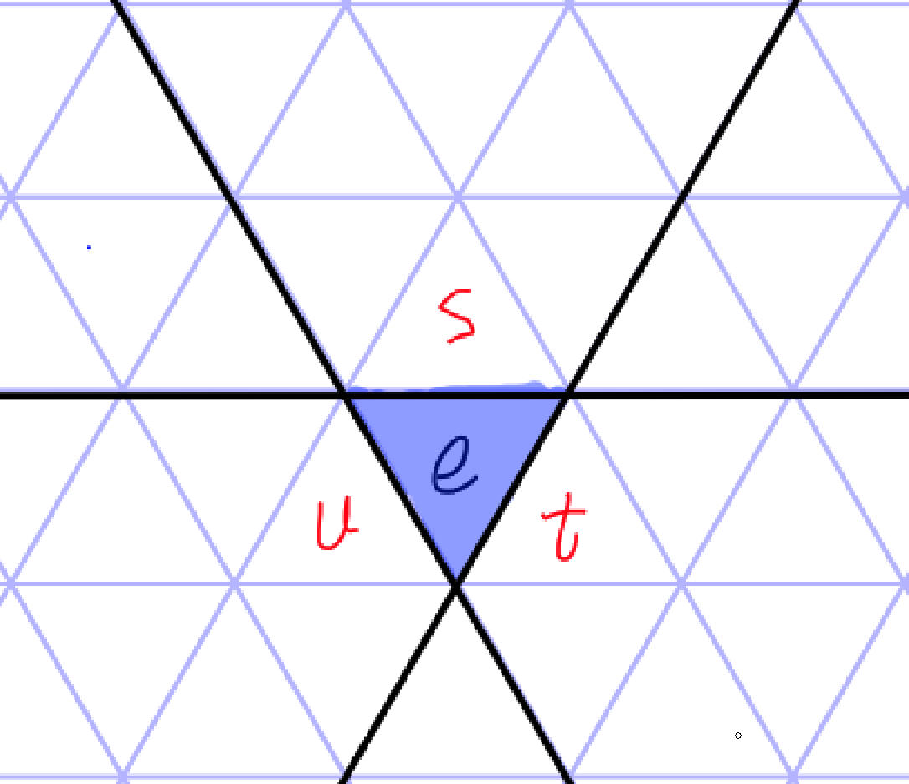
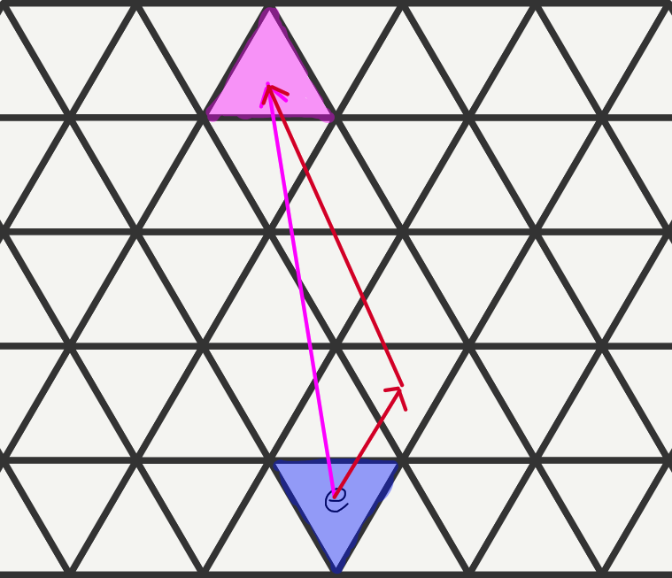
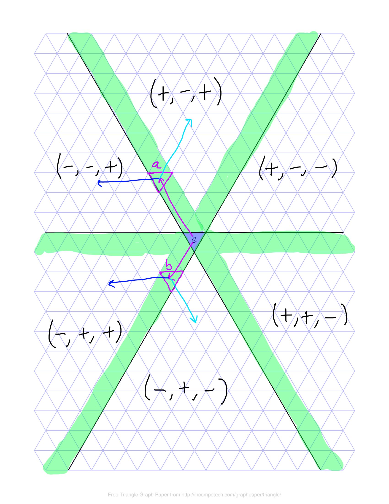
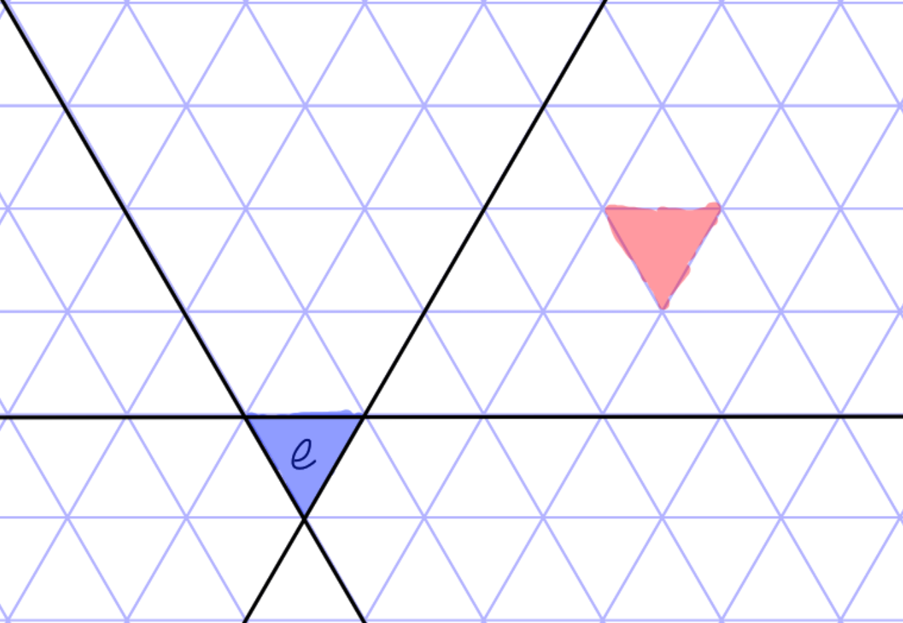

## Introduction

This README document will include relevant information on how to use the code as well as some semblance of documentation on how it works.

## How to use

The basic how to use at this moment is as follows:

1. Download code files.

2. Edit `main.cpp` file to include which points you would like to generate a shadow from

3. Compile and run

### Downloading Code Files

There are two main ways to do this; running `git clone` or downloading the zip file.

#### Git Clone

If you have `git` installed, simply open your terminal, navigate to whichever directory you want to install the code to, and run the following command:

```
git clone https://github.com/pattydaone/Garside-Shadows.git
```

This will copy the contents of the github repository into a directory by the name of `Garside-Shadows`.

#### Download the zip

In the github repository, locate the large green button in the top right that says `<> Code`. Click on it and then click `Download ZIP`. Allow the ZIP file to download, 
then extract it to whichever directory you so please.

### Editing main.cpp file

At the bottom of the `main.cpp` file, there is a function of the form:

```{cpp}
int main() {
    ShadowGenerator gen;

    std::vector<OmegaInt> points {{
        // ...
    }};

    std::vector<std::string> inputWords {
        // ...
    };

    gen.addPoints(inputWords);
    gen.generateShadow();

    // ...
    
    return 0;
}
```

Words which you want to add may be added within the `inputWords` variable. Input words as strings and separated by commas. For example:

```{cpp}
std::vector<std::string> inputWords {
    "stsu", "suts"
};
```

Words do not have to be in reduced form; however, must be generated with the following generator orientation:



If you choose to add points as defined in the barycentric coordinate system, you may do so within the `points` variable; but you must likewise edit the `gen.addPoints` line. For example:

```{cpp}
int main() {
    ShadowGenerator gen;

    std::vector<OmegaInt> points {{
        { -1, -2, 2 }, { 2, -3, 2 }
    }};

    // ...

    gen.addPoints(points); // Note the change here
    gen.generateShadow();

    // ...

    return 0;
}
```

### Compile

Compiling the program depends on your choice of operating system. 

#### MacOs

The typical compiler used on MacOs is `clang++`, which is included in the Xcode CLI tools. 

To check if the tools are installed, first open terminal.

Next, run `xcode-select -p`. If this command returns a valid file path, they are installed. If it returns an error, you must install it. 

To install, run `xcode-select --install`. 

`clang++` should be installed now. To check, simple run `clang++` in your terminal; you should receive the following output: `clang++: error: no input files`.

In terminal, navigate to the directory which you installed the code files to. There are two ways to do this:

##### From terminal

Note the path which you have installed the files to and the run the `cd` command to move into it (cd stands for "change directory"). For example, if your files are installed to `~/Downloads/Garside-Shadows/`, you may open the terminal and run `cd ~/Downloads/Garside-Shadows/` to move into the folder.

##### From finder

Alternatively you can navigate to the folder in finder, locate the path bar at the bottom of the application, right click on the folder, and then click on "open in terminal".

Now that you have the folder opened in terminal, run the following command:

`clang++ -Wall main.cpp -o main.o`

This will compile the code into an object called `main.o`, which will be placed in the same directory.

#### Windows

To be honest, I am unfamiliar with this sort of stuff on windows. I will fill this in at a later time.

#### Linux

If you're on linux I imagine you have a good idea of what to do, so I'll give a brief overview and let you fill in the blanks.

Almost all linux distributions come with `gcc` preinstalled so there's nothing to do with respect to that.

To compile, simply `cd` to the code directory and run something such as:

`gcc -Wall main.cpp -o main.o`

This should compile the code into a `main.o` object.

### Running

To run the object file, remain in the code directory and run the following command:

`./main.o`

This will run the command and print the output to the relevant files: `points.txt` and `words.txt`.

## How it is implemented

The birds eye overview of how the program works is as follows:

1. Implement the coxeter complex as a coordinate system, and then implement relevant functions tied to this coordinate system. Notably: vector arithmetic and decomposition.

2. Implement a means by which to translate points in the coordinate system to words in the coxeter groups, and vice versa. 

3. Implement the shadow generation algorithm in the coordinate system; joins are implemented using vector addition as a result of the parrellelogram rule for joins.

We will take a greater look at all of these.

### The coordinate system.

The coordinate system, as well as vector arithmetic, implemented is defined in a paper which I greatly referenced, and will now link:

https://pmc.ncbi.nlm.nih.gov/articles/PMC8004019/#sec2-entropy-23-00373

#### Vector Arithmetic Changes

Two notable changes have been made.

First, one of the procedures that must be figured out when adding vectors is the output vector's type (A, B, or C). When determining the resultant type of vectors which share the same type, there is 
a little nuance that must be applied. I conjecture this is how we determine types of the input vectors: vectors which border on types (vectors with more than 1 integer component), they are classified 
as the first type which it comes across. For example, if the vector borders type A and B, it will be classified as type A, even though classifying it as type B is still correct. Another example, if the 
vector borders type B and C, it will be classified as a type B vector. 

To get to how this messes things up: if we have two type A vectors, it may not satisfy any of the conditions laid out in table 3 in the paper linked above. Thus, at the end of the function (which can 
be found by the name `sameTypeA` in the file `omega.h`), we simply return A should all of the if statements fail. For the same reason, we return 'B' in `sameTypeB` function. We do not, however, return 'C' 
in `sameTypeC`. This is because I have no reason beyond speculation and conjecture for this being true, but if it is true, and this only happens with vectors that *border* between types, 
then this case should never happen for C. Consider the second bordering example above: we had a vector which bordered types B and C. Because the returned type prioritises the first type found, this case 
will always return B. Thus, it is quite easy to see how, should a vector border types, C will never happen, and this bordering issue will never occur within the `sameTypeC` function. Therefore, at the 
end of this function, I return 'a'; this is an *error* return value. If it is returned, an error is thrown. As already stated, I am unsure exactly how true my conjecture is, so if this ever happens I 
would like to know so I can investigate *why*. With that said: a return value of 'a' from `sameTypeC` has never been observed by me in all my testing.

The second change is within the final step of the algorithm. Under section 3.2 of the above linked paper, within the table at step 3, there is the following:

> (b) If ((i + j + k) > 2) Then, let r: = (i − 1, j − 1, k − 1) 
>
>   Else If ((i + j + k) < −2) Then, let r: = (i + 1, j + 1, k + 1).

This has been edited to be inclusive:

> (b) If ((i + j + k) >= 2) Then, let r: = (i − 1, j − 1, k − 1) 
>
>   Else If ((i + j + k) <= −2) Then, let r: = (i + 1, j + 1, k + 1).

This edit was made as a result of me finding some output vectors which summed to exactly 2 and -2. Obviously this cannot be the case, as all points' sums must be contained within the interval `[-1, 1]`. 
I suspect sums are exactly 2 and -2 if the two input vectors are all integer vectors. I do not know this to be the case, what I do know, however, is that for all my testing, this change gives the 
expected sums.

There is another important issue to note. The paper also defines the "absolute rounding up" operation and offers two ways to evaluate it, claiming they are equivalent. They are not.

onsider x = 1. By the first definition, $\text{absRoundingUp}(x) = sgn(x)\*\lfloor \abs{x}\rfloor + sgn(x - sgn(x)\*\lfloor \abs{x}\rfloor) = 1 + 0 = 1

By the second definition, $\text{absRoundingUp}(x) = sgn(x)\*<\abs{x} + 1/2> = 1\*<3/2> = 2.

As we can see, these definitions disagree. I implemented the former definition, as the output agrees more with what the name implies.

#### Decomposition

The paper above does not define decomposition, and so I had to come up with something. Please bear in mind, what follows is horrible, hacky, and just bad in ever manner imaginable. If you can think up a 
better implementation, I would encourage you to do so.

Because vectors in this coordinate system aren't defined conveniently as a shift in x followed by a shift in y, decomposition is not very clear, and so I will attempt to define what I mean intuitively. 
Essentially, I am referring to taking a vector to a point, and then decomposing it into two vectors which follow reduced paths to the final point. I will present a visual example:



I hope this gives good intuition!
 
I am actually not going to type this out right now. TODO: type this out.

### Connect the group to the coordinate system

This is actually rather simple, but we must make an observation first. When we move through the coxeter complex, we do it via a series of reflections. We reflect across one plane and reflect the other two 
planes with it. This is how we keep track of which generators to append to our words. This concept can be tied to types in our coordinate system. We can think of each hyperplane being embedded in a 
specific type. For example, with the Generator Orientation image shown above, we have generator 's' embedded within type 'B'; 't' embedded within 'A'; and 'u' embedded within 'C'. Thus, we start by 
associating each generator with the type it's embedded within. Now, when we reflect across a plane, this looks like moving through that type in the coordinate system. For example, if we reflect across 
's', this simply looks like translating through type 'B'. But now we have to keep track of the other generators' reflections. It turns out that whenever we reflect across a plane, the generator which we 
reflected across remains embedded in the same type, and the other two generators swap the type they were embedded in. For example, with out previous example we reflected across 's', which brought us 
through type 'B'. So 's' stays embedded withing 'B', and the other two swap: 't' becomes embedded within 'C' and 'u' becomes embedded within 'A'. This appears to be true in general, and this action must 
be performed and kept track of throughout.

#### From points to words

Given a point, we want to output a corresponding reduced word. The general algorithm is as follows:

1. Decompose the point into two vectors.

2. Navigate from the identity to the end of the first vector; doing reflections and adding to a word string along the way.

3. Navigate from the end of the first vector to the point; again, doing reflections and adding to the word string along the way.

The navigation part is a little tricky. How do we know which way to go? The way I implemented this was by hardcoding every possible path one could take, and choosing paths based on the 
region the point lies in. Since there are not too many, this was not too difficult. The paths are encoded with a string of length two, and represent the types the points must travel through. 
It can be found and investigated further in the `groups.h` file.

#### From words to points

Given a word, we want to output the corresponding point. The algorithm is as follows:

for letter in word

if letter == 's': navigate through the type that s is embedded in; reflect after navigation is complete.

if letter == 't': navigate through the type that t is embedded in; reflect after navigation is complete.

if letter == 'u': navigate through the type that u is embedded in; reflect after navigation is complete.

Once the for loop is finished, you simply output the point which you navigated with.

> **Note:** If you'll notice, there is nothing within this which dictates the word must be reduced. Thus, it is not difficult to see how one could leverage this functionality as a word reducer.

### Shadow Generation

#### Joins

Joins are the trickiest part. First, we will discuss how to determine whether the join of two elements exists.

##### Existence

Consider some point in the coordinate system. We will associate with it a set of accessible regions. This set includes all the regions which can be accessed by a reduced path which passes through it. 
A picture to visualise this idea will be provided below:



In the above photo, it's important to note that everything highlighted in green has two accessible regions; further, the three points directly adjacent to the identity element have three accessible 
regions; everything else has only one accessible region (that being itself).

To now find the existence of a join between two points, the algorithm is as follows:

1. Calculate the sets of accessible regions associated with each point.

2. Take their intersection.

3. If their intersection is non-empty, the join exists; else, the join does not exist.

> **Note:** This is not formally proven; this is an observation which apppears, for all intents and purposes, to be true.

##### Estimation

Naturally, if the join does not exist, we do not attempt to calculate. We assume from here on that we have determined the join does exist. The algorithm for a join estimate is as follows:

1. Calculate the decomposition of each vector.

2. Compare the directions of vectors between each decomposed set; match together vectors which point in the same direction.

3. Compare the magnitude of directionally matched vectors; drop the vector with the smaller magnitude.

4. Now you should have only two vectors. Their sum will be an estimation of the join.

Why do we say estimation? Well, this is because this algorithm can fail in two ways. 

1. The overshooting problem: sometimes, this algorithm overshoots the join by exactly one element.

2. The edge problem: sometimes, even more rarely, this algorithm lands on an edge.

##### Overshooting

Overshooting is rather simple to correct. It hinges on the observation that reduced joins must be positive or negative depending on the region it falls in. 



Observe the red element above. In order for any reduced path to access it, the path must pass through the "final wall" which faces towards the identity element. This means that, should this element 
or one like it be estimate as the join of two elements, both paths will pass through that final wall, which means they will pass through the element just before that wall. Thus, we can see that this 
element before the final wall will also be the join. Something to note about this element is that it appears to be pointing *towards* the identity element. What we can extrapolate from this example 
is that the join of elements in any region must point towards the identity element -- with the exception being trivial joins.

> **Note:** This last fact is important, and therefore, before we conduct overshooting tests, we must first check to ensure the join is non-trivial.

The way we check the orientation of the triangles in the coordinate system is by the component sums. In the pictured example above, we can see that the triangles in this region which will have a final 
wall are all negative, and therefore, all non-trivial joins in this region must be positive (so their component sum must be equal to 1). 

A similar though process is to be applied to every other region, and checks must be implemented.

##### Edges

The edge problem has a similar solution but it is backed up with much less reasoning. The idea is that the estimated join which falls on an edge will always be oriented the same way with respect to 
the actual join depending on the region. I have no real justification for how the translations were chosen other than looking at examples and assuming them to be universal; each translation can 
be found in the code, within `shadowGenerators.h` file, under the method `checkSides`.

#### Reflections

Reflections are thankfully very easy, as the coordinate system allows them inherently with little work. But there is one nuance.

##### Reflecting across the hyperplane embedded within A

Given point $a = (i, j, k)$, it's reflection across the plane embedded within type A at the identity point is $r = (-1\*i, -1\*k, -1\*j)$

In words, we negate every component as well as swapping the j and k components.

##### Reflecting across the hyperplane embedded within C

Given point $c = (i, j, k)$, it's reflection across the plane embedded within type C at the identity point is $r = (-1\*j, -1\*i, -1\*k)$

In words, we negate every component as well as swapping the i and j components.

##### Reflecting across the hyperplane embedded within B

Given point $b = (i, j, k)$, it's reflection across the plane embedded withing type B at the identity point is $r = (-1\*k + 1, -1\*j - 2, -1\*i + 1)$

In words, we negate every component, swap the i and k components, add 1 to the first and last component, and subtract 2 from the second component. 

Why is this one different? It's because that this symmetry is actually reflecting with respect to the planes which separate the regions in the coordinate system; this hyperplane is shifted by one 
from the plane we are actually reflecting across, so we then have to shift the reflection point by 2 elements to get it to the right reflection.


### Final words

The above outlines what I believe to be the most necessary things a person should know to implement this, but it is not psuedo-code. There is still much that you must do to tie all of these together.

Further, the process described above may work in other groups which can be represented by a coxeter complex of triangles, but I am unsure how well the coordinate system and its algorithms will transfer, 
if at all; I have not investigated this myself.
